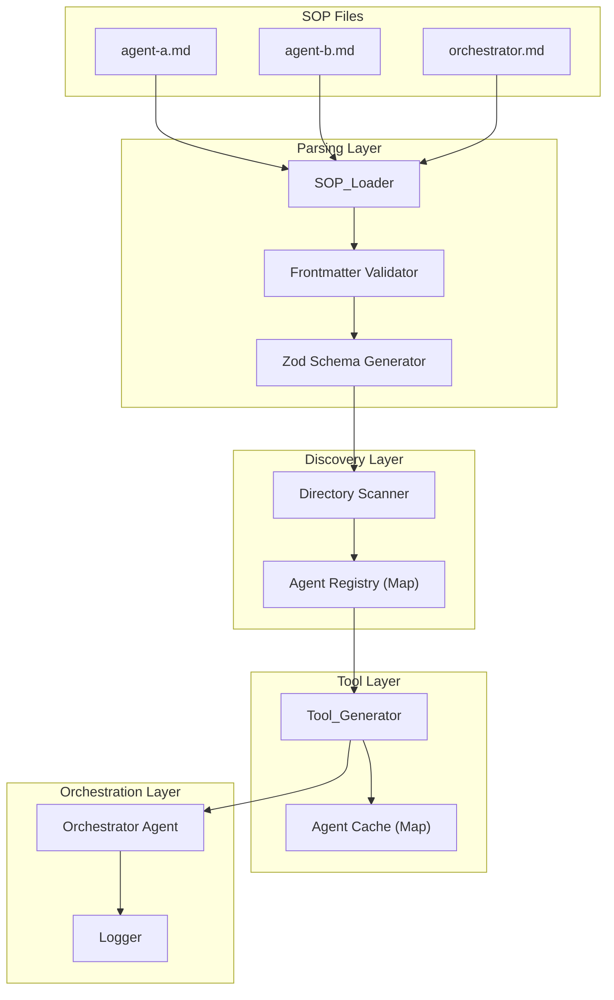

# Design Document: SOP Orchestrator

## Overview

The SOP Orchestrator is a TypeScript-based multi-agent orchestration system that enables agents to be defined as markdown files with YAML frontmatter. The system auto-discovers available agents at runtime, generates Strands SDK tools from agent definitions, and delegates tasks to appropriate agents based on their descriptions.

The architecture follows a layered approach:
1. **Parsing Layer**: Loads and validates SOP markdown files using gray-matter
2. **Schema Layer**: Converts input definitions to Zod schemas for runtime validation
3. **Discovery Layer**: Scans directories and builds an agent registry
4. **Tool Layer**: Generates Strands tools from agent definitions
5. **Orchestration Layer**: Manages the master agent and task delegation

## Architecture



## Components and Interfaces

### Core Data Types

```typescript
/**
 * Supported input types for SOP parameters
 */
type InputType = "string" | "number" | "boolean" | "enum" | "list";

/**
 * Definition for a single input parameter in an SOP
 */
interface InputDef {
  type: InputType;
  description: string;
  required?: boolean;      // defaults to true
  default?: unknown;       // default value if not provided
  values?: string[];       // only for enum type
}

/**
 * YAML frontmatter structure for SOP files
 */
interface SOPFrontmatter {
  name: string;            // required: agent name
  description: string;     // required: agent description
  version?: string;        // optional: semver version
  tools?: string[];        // optional: additional tools to inject
  inputs?: Record<string, InputDef>;  // optional: input parameters
  type?: "agent" | "orchestrator";    // defaults to "agent"
}

/**
 * Complete parsed SOP definition
 */
interface SOPDefinition {
  name: string;
  description: string;
  version: string;
  tools: string[];
  inputs: Record<string, InputDef>;
  body: string;            // markdown content after frontmatter
  filepath: string;        // original file path
  type: "agent" | "orchestrator";
  zodSchema: z.ZodObject<any>;  // always has at least { task: z.string() }
}
```

### SOP_Loader Interface

```typescript
interface SOPLoader {
  /**
   * Parse a single SOP file and return its definition
   * @throws Error if file doesn't exist or frontmatter is invalid
   */
  loadSOP(filepath: string): Promise<SOPDefinition>;
  
  /**
   * Validate frontmatter against required schema
   * @throws Error with descriptive message if validation fails
   */
  validateFrontmatter(data: unknown, filepath: string): SOPFrontmatter;
  
  /**
   * Generate Zod schema from input definitions
   * Always returns a schema with at least { task: z.string() }
   */
  generateZodSchema(inputs?: Record<string, InputDef>): z.ZodObject<any>;
}
```

### Agent_Discovery Interface

```typescript
interface AgentDiscovery {
  /**
   * Scan directory for SOP files and build agent registry
   * @param directory - path to scan (default: "./sops")
   * @returns Map of agent name to SOPDefinition (excludes orchestrators)
   * @throws Error if directory doesn't exist
   */
  discoverAgents(directory?: string): Promise<Map<string, SOPDefinition>>;
  
  /**
   * Find the orchestrator SOP in a directory
   * @throws Error if no orchestrator found or multiple found
   */
  findOrchestrator(directory?: string): Promise<SOPDefinition>;
}
```

### Tool_Generator Interface

```typescript
interface ToolGenerator {
  /**
   * Create a Strands tool from an SOP definition
   */
  createTool(sop: SOPDefinition): InvokableTool;
  
  /**
   * Create tools for all agents in registry
   */
  createAllTools(registry: Map<string, SOPDefinition>): InvokableTool[];
  
  /**
   * Get or create cached agent instance
   */
  getOrCreateAgent(sop: SOPDefinition): Agent;
  
  /**
   * Clear the agent cache
   */
  clearCache(): void;
}
```

### Orchestrator Interface

```typescript
type ErrorMode = "fail-fast" | "continue";

interface OrchestratorConfig {
  directory?: string;      // default: "./sops"
  errorMode?: ErrorMode;   // default: "fail-fast"
  logLevel?: "debug" | "info" | "warn" | "error";  // default: "info"
}

interface Orchestrator {
  /**
   * Initialize the orchestrator by discovering agents and creating tools
   */
  initialize(): Promise<void>;
  
  /**
   * Process a request through the orchestrator agent
   * @returns Final response string
   */
  invoke(request: string): Promise<string>;
  
  /**
   * Clear agent cache
   */
  clearCache(): void;
  
  /**
   * Get the agent registry (for inspection/debugging)
   */
  getRegistry(): Map<string, SOPDefinition>;
  
  /**
   * Current configuration (readonly for inspection)
   */
  readonly config: OrchestratorConfig;
}
```

### Logger Interface

```typescript
interface LogEntry {
  timestamp: Date;
  correlationId: string;
  level: "debug" | "info" | "warn" | "error";
  agentName?: string;
  message: string;
  duration?: number;       // milliseconds
  error?: Error;
  metadata?: Record<string, unknown>;
}

interface Logger {
  debug(message: string, metadata?: Record<string, unknown>): void;
  info(message: string, metadata?: Record<string, unknown>): void;
  warn(message: string, metadata?: Record<string, unknown>): void;
  error(message: string, error?: Error, metadata?: Record<string, unknown>): void;
  
  /**
   * Create a child logger with correlation ID
   */
  withCorrelationId(correlationId: string): Logger;
  
  /**
   * Create a child logger with agent context
   */
  withAgent(agentName: string): Logger;
  
  /**
   * Set the minimum log level
   */
  setLevel(level: "debug" | "info" | "warn" | "error"): void;
}
```

## Data Models

### SOP File Format

```yaml
---
name: code-reviewer
description: Reviews code for best practices and potential issues
version: 1.0.0
type: agent
tools:
  - file_reader
inputs:
  file_path:
    type: string
    description: Path to the file to review
    required: true
  review_type:
    type: enum
    description: Type of review to perform
    values: [security, performance, style, all]
    default: all
  include_suggestions:
    type: boolean
    description: Whether to include improvement suggestions
    default: true
---

# Code Reviewer Agent

You are a code review specialist. When given a file path and review type,
analyze the code and provide detailed feedback.

## Review Guidelines

- Focus on the specified review type
- Provide actionable feedback
- Include line numbers when referencing issues
```

### Tool Schema Generation

For each SOP, the tool schema combines a required `task` field with the SOP's inputs:

```typescript
// Generated schema for code-reviewer tool
z.object({
  task: z.string().describe("The specific task to perform"),
  file_path: z.string().describe("Path to the file to review"),
  review_type: z.enum(["security", "performance", "style", "all"])
    .default("all")
    .describe("Type of review to perform"),
  include_suggestions: z.boolean()
    .default(true)
    .describe("Whether to include improvement suggestions")
})
```

### Agent Prompt Construction

When a tool is invoked, the handler constructs a prompt for the sub-agent:

```typescript
function buildAgentPrompt(task: string, inputs: Record<string, unknown>): string {
  const inputSection = Object.entries(inputs)
    .filter(([key]) => key !== "task")
    .map(([key, value]) => `- ${key}: ${JSON.stringify(value)}`)
    .join("\n");
  
  return `## Task
${task}

## Input Parameters
${inputSection}`;
}
```

## Correctness Properties

*A property is a characteristic or behavior that should hold true across all valid executions of a system—essentially, a formal statement about what the system should do. Properties serve as the bridge between human-readable specifications and machine-verifiable correctness guarantees.*


### Property 1: SOP Parsing Round-Trip

*For any* valid SOP file content with frontmatter and body, parsing the file should produce a SOPDefinition where the body matches the original markdown content and all frontmatter fields are correctly extracted.

**Validates: Requirements 1.1, 1.4**

### Property 2: Frontmatter Validation Rejects Invalid Input

*For any* frontmatter object missing required fields (name or description), or containing invalid type values, or with malformed YAML, validation should throw a descriptive error indicating the specific problem.

**Validates: Requirements 1.2, 2.1, 2.2, 2.4, 2.6**

### Property 3: Type Field Defaults to Agent

*For any* valid frontmatter without a `type` field, the parsed SOPDefinition should have type equal to "agent".

**Validates: Requirements 2.5**

### Property 4: Schema Generation Type Correctness

*For any* InputDef with a specified type, the generated Zod schema should:
- Accept values of the correct type
- Reject values of incorrect types
- Apply default values when specified
- Mark fields as optional when required is false
- Include descriptions in schema metadata

**Validates: Requirements 1.3, 3.1, 3.2, 3.3, 3.4, 3.5, 3.6, 3.7, 3.8**

### Property 5: Agent Discovery Filtering

*For any* directory containing SOP files, Agent_Discovery should return a Map containing only SOPs where type is "agent" or type is not specified (defaulting to "agent"), with agent name as key and SOPDefinition as value.

**Validates: Requirements 4.1, 4.2, 4.3**

### Property 6: Discovery Error Resilience

*For any* directory containing a mix of valid and invalid SOP files, Agent_Discovery should successfully parse all valid files and log errors for invalid files without failing the entire operation.

**Validates: Requirements 4.4, 4.5**

### Property 7: Tool Generation Correctness

*For any* SOPDefinition, the generated Strands tool should:
- Have name matching pattern `agent_{sop.name}`
- Have description matching sop.description
- Have schema including required `task` field of type string
- Have schema including all fields from sop.inputs with correct types and constraints

**Validates: Requirements 5.1, 5.2, 5.3, 5.4, 5.7**

### Property 8: Agent Caching Idempotence

*For any* SOPDefinition, calling getOrCreateAgent multiple times should return the same agent instance (reference equality).

**Validates: Requirements 6.1, 6.2**

### Property 9: Orchestrator Initialization Validation

*For any* directory, Orchestrator initialization should:
- Succeed if exactly one orchestrator SOP exists
- Fail with descriptive error if no orchestrator exists
- Fail with descriptive error if multiple orchestrators exist
- Inject all discovered agent tools into the orchestrator

**Validates: Requirements 7.1, 7.2, 7.5, 7.6**

### Property 10: Error Mode Behavior

*For any* orchestrator invocation where an agent tool fails:
- In "fail-fast" mode: error should propagate immediately with agent context
- In "continue" mode: execution should continue, and final response should include partial results and error information

**Validates: Requirements 8.5, 8.6, 8.7**

### Property 11: Logging Completeness

*For any* agent tool invocation, logs should include:
- Correlation ID for request tracing
- Agent name in all related log entries
- Task and input parameters at invocation start
- Duration and response summary on success
- Error type, message, and stack trace on failure

**Validates: Requirements 9.1, 9.2, 9.3, 9.4, 9.5, 9.6**

## Error Handling

### Error Categories

| Error Type | Cause | Handling |
|------------|-------|----------|
| `FileNotFoundError` | SOP file doesn't exist | Throw with filepath |
| `FrontmatterParseError` | Malformed YAML | Throw with parse location |
| `FrontmatterValidationError` | Missing required fields or invalid values | Throw with field name and reason |
| `DirectoryNotFoundError` | Discovery directory doesn't exist | Throw with directory path |
| `OrchestratorNotFoundError` | No orchestrator SOP in directory | Throw with directory path |
| `MultipleOrchestratorsError` | More than one orchestrator SOP | Throw with list of files |
| `AgentInvocationError` | Sub-agent fails during execution | Handle based on errorMode |

### Error Propagation Strategy

```typescript
/**
 * Base error class for all SOP-related errors
 */
class SOPError extends Error {
  constructor(
    message: string,
    public readonly code: string,
    public readonly context: Record<string, unknown>
  ) {
    super(message);
    this.name = "SOPError";
  }
}

/**
 * Thrown when an SOP file cannot be found
 */
class FileNotFoundError extends SOPError {
  constructor(filepath: string) {
    super(
      `SOP file not found: ${filepath}`,
      "FILE_NOT_FOUND",
      { filepath }
    );
    this.name = "FileNotFoundError";
  }
}

/**
 * Thrown when frontmatter YAML is malformed
 */
class FrontmatterParseError extends SOPError {
  constructor(filepath: string, parseError: string) {
    super(
      `Failed to parse frontmatter in ${filepath}: ${parseError}`,
      "FRONTMATTER_PARSE_ERROR",
      { filepath, parseError }
    );
    this.name = "FrontmatterParseError";
  }
}

/**
 * Thrown when frontmatter fails validation
 */
class FrontmatterValidationError extends SOPError {
  constructor(filepath: string, field: string, reason: string) {
    super(
      `Invalid frontmatter in ${filepath}: ${field} - ${reason}`,
      "FRONTMATTER_VALIDATION_ERROR",
      { filepath, field, reason }
    );
    this.name = "FrontmatterValidationError";
  }
}

/**
 * Thrown when discovery directory doesn't exist
 */
class DirectoryNotFoundError extends SOPError {
  constructor(directory: string) {
    super(
      `Directory not found: ${directory}`,
      "DIRECTORY_NOT_FOUND",
      { directory }
    );
    this.name = "DirectoryNotFoundError";
  }
}

/**
 * Thrown when no orchestrator SOP is found
 */
class OrchestratorNotFoundError extends SOPError {
  constructor(directory: string) {
    super(
      `No orchestrator SOP found in ${directory}`,
      "ORCHESTRATOR_NOT_FOUND",
      { directory }
    );
    this.name = "OrchestratorNotFoundError";
  }
}

/**
 * Thrown when multiple orchestrator SOPs are found
 */
class MultipleOrchestratorsError extends SOPError {
  constructor(directory: string, files: string[]) {
    super(
      `Multiple orchestrator SOPs found in ${directory}: ${files.join(", ")}`,
      "MULTIPLE_ORCHESTRATORS",
      { directory, files }
    );
    this.name = "MultipleOrchestratorsError";
  }
}

/**
 * Thrown when an agent invocation fails
 */
class AgentInvocationError extends SOPError {
  constructor(agentName: string, task: string, originalError: Error) {
    super(
      `Agent '${agentName}' failed: ${originalError.message}`,
      "AGENT_INVOCATION_ERROR",
      { agentName, task, originalError: originalError.message }
    );
    this.name = "AgentInvocationError";
    this.cause = originalError;
  }
}
```

### Error Mode Behavior

**Fail-Fast Mode (default)**:
```typescript
// On agent failure, immediately throw with context
throw new SOPError(
  `Agent '${agentName}' failed: ${error.message}`,
  "AGENT_INVOCATION_ERROR",
  { agentName, task, originalError: error }
);
```

**Continue Mode**:
```typescript
// On agent failure, log and continue
interface AgentResult {
  agentName: string;
  success: boolean;
  result?: string;
  error?: {
    message: string;
    code: string;
  };
}

// Final response includes all results
interface OrchestratorResponse {
  success: boolean;
  results: AgentResult[];
  partialFailure: boolean;
}
```

## Testing Strategy

### Dual Testing Approach

The SOP Orchestrator requires both unit tests and property-based tests for comprehensive coverage:

- **Unit tests**: Verify specific examples, edge cases, and integration points
- **Property tests**: Verify universal properties across randomly generated inputs

### Property-Based Testing Configuration

- **Library**: [fast-check](https://github.com/dubzzz/fast-check) for TypeScript
- **Minimum iterations**: 100 per property test
- **Tag format**: `Feature: sop-orchestrator, Property {number}: {property_text}`

### Test Categories

#### Unit Tests

1. **SOP_Loader**
   - Parse valid SOP file with all fields
   - Parse SOP file with minimal fields (name, description only)
   - Handle missing file gracefully
   - Validate frontmatter error messages

2. **Agent_Discovery**
   - Discover agents in directory with mixed file types
   - Handle empty directory
   - Handle non-existent directory
   - Exclude orchestrator files

3. **Tool_Generator**
   - Generate tool with all input types
   - Generate tool with no inputs
   - Verify tool schema structure

4. **Orchestrator**
   - Initialize with valid directory
   - Handle missing orchestrator
   - Handle multiple orchestrators
   - Test both error modes

#### Property Tests

Each correctness property (P1-P11) should be implemented as a property-based test with appropriate generators:

```typescript
// Example: Property 4 - Schema Generation Type Correctness
import fc from "fast-check";

// Generator for InputDef
const inputDefArb = fc.record({
  type: fc.constantFrom("string", "number", "boolean", "enum", "list"),
  description: fc.string({ minLength: 1 }),
  required: fc.option(fc.boolean()),
  default: fc.option(fc.anything()),
  values: fc.option(fc.array(fc.string(), { minLength: 1 }))
}).filter(def => {
  // enum type requires values
  if (def.type === "enum") return def.values !== undefined;
  return true;
});

// Property test
test("Property 4: Schema generation type correctness", () => {
  fc.assert(
    fc.property(inputDefArb, (inputDef) => {
      const schema = generateZodSchema({ testField: inputDef });
      // Verify schema accepts correct type
      // Verify schema rejects incorrect types
      // Verify defaults are applied
    }),
    { numRuns: 100 }
  );
});
```

### Test File Structure

```
src/
├── __tests__/
│   ├── sop-loader.test.ts        # Unit tests for SOP_Loader
│   ├── sop-loader.property.ts    # Property tests for SOP_Loader
│   ├── agent-discovery.test.ts   # Unit tests for Agent_Discovery
│   ├── agent-discovery.property.ts
│   ├── tool-generator.test.ts    # Unit tests for Tool_Generator
│   ├── tool-generator.property.ts
│   ├── orchestrator.test.ts      # Unit tests for Orchestrator
│   ├── orchestrator.property.ts
│   └── generators/               # Shared test generators
│       ├── sop.ts                # SOP content generators
│       └── inputs.ts             # InputDef generators
```

### Mocking Strategy

For integration points with external systems:

1. **File System**: Use in-memory file system (memfs) or temp directories
2. **Strands Agent**: Mock Agent class to verify tool invocation and prompt construction
3. **Logger**: Use spy/mock to verify log output

## Implementation Notes

### Dependencies

```json
{
  "dependencies": {
    "@strands-agents/sdk": "^0.2.0",
    "gray-matter": "^4.0.3",
    "zod": "^3.23.0"
  },
  "devDependencies": {
    "fast-check": "^3.15.0",
    "vitest": "^1.0.0"
  }
}
```

### File Structure

```
src/
├── index.ts              # Public API exports
├── types.ts              # Type definitions
├── sop-loader.ts         # SOP_Loader implementation
├── agent-discovery.ts    # Agent_Discovery implementation
├── tool-generator.ts     # Tool_Generator implementation
├── orchestrator.ts       # Orchestrator implementation
├── logger.ts             # Logger implementation
└── errors.ts             # Custom error classes
```

### Public API

```typescript
// index.ts - Public API exports

// Factory function
export { createOrchestrator } from "./orchestrator";

// Types
export type {
  Orchestrator,
  OrchestratorConfig,
  SOPDefinition,
  SOPFrontmatter,
  InputDef,
  InputType,
  ErrorMode,
  Logger,
  LogEntry,
} from "./types";

// Error classes for instanceof checks
export {
  SOPError,
  FileNotFoundError,
  FrontmatterParseError,
  FrontmatterValidationError,
  DirectoryNotFoundError,
  OrchestratorNotFoundError,
  MultipleOrchestratorsError,
  AgentInvocationError,
} from "./errors";

// Usage example:
// import { createOrchestrator } from "agent-sop";
//
// const orchestrator = await createOrchestrator({
//   directory: "./sops",
//   errorMode: "continue",
//   logLevel: "info"
// });
//
// const result = await orchestrator.invoke("Research AI trends and write a summary");
```

### Key Design Decisions

1. **gray-matter for parsing**: Well-tested library used by major projects (Gatsby, Astro, etc.)

2. **Zod for schema validation**: Native TypeScript support, excellent error messages, and built-in JSON schema generation for Strands tools

3. **Map for registries**: O(1) lookup by agent name, maintains insertion order

4. **Lazy agent instantiation**: Agents are only created when first invoked, reducing startup overhead

5. **Correlation IDs**: UUID v4 for unique request tracing across distributed logs

6. **Error modes**: Configurable behavior allows users to choose between strict and resilient execution
